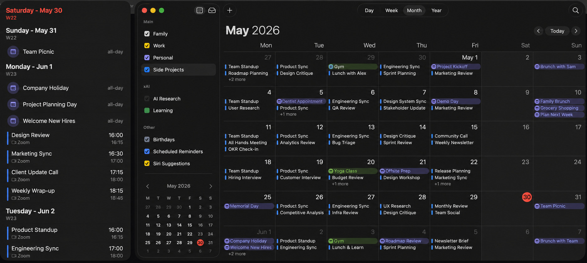

# Calendar++

A lightweight macOS menu bar app that shows a slim event list panel pinned to the side of Apple's Calendar app, mirroring the iPad day-list view.

## What it does

- Lives in the menu bar (no Dock icon) and shows a floating side panel next to Calendar.app
- The panel tracks the Calendar window: it hugs the left or right edge and smoothly follows as you move or resize Calendar
- It is visible only while Calendar is the frontmost app, and hides when Calendar is minimized, closed, or in the background
- Lists past and upcoming events grouped by day and sorted by time, with each event in its real calendar color, all-day events, and conference badges (Zoom, Meet, Teams, and more)
- Opens scrolled to today, with a "Today" button in the top day header to jump back after scrolling
- Tapping an event reveals it in Calendar.app

## How?

Calendar++ reads directly from the same local store as Apple's Calendar via EventKit, so every account you already have (iCloud, Google, local) shows up automatically. There is no separate login.

## Permissions

All are one-time native prompts, no accounts:

- Calendar: to read your events
- Accessibility: to track the Calendar window position
- Automation: to reveal a tapped event inside Calendar

## Requirements

- macOS 26 (Tahoe) or later
- Built with SwiftUI and AppKit

## Building

Open `CalendarPlusPlus.xcodeproj` in Xcode and run. The app is non sandboxed and signed locally for personal use.
